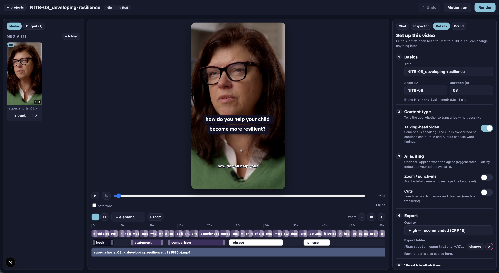
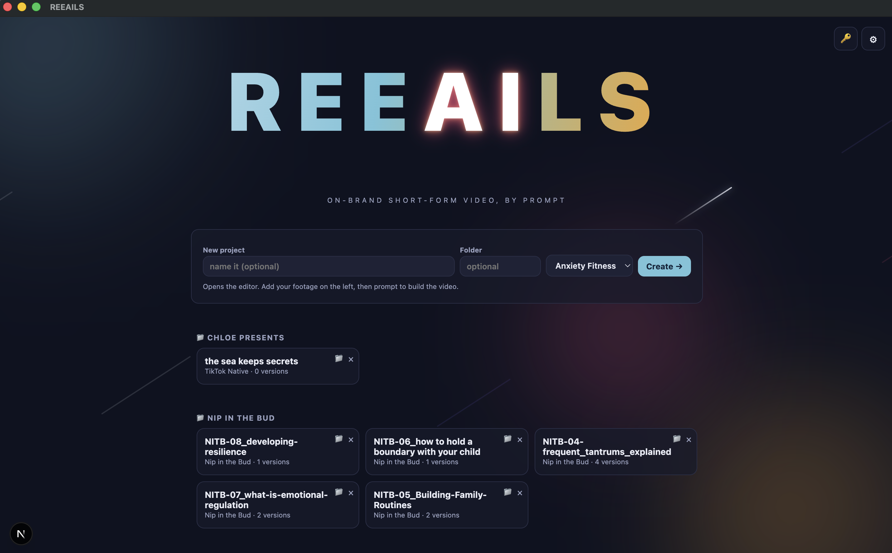
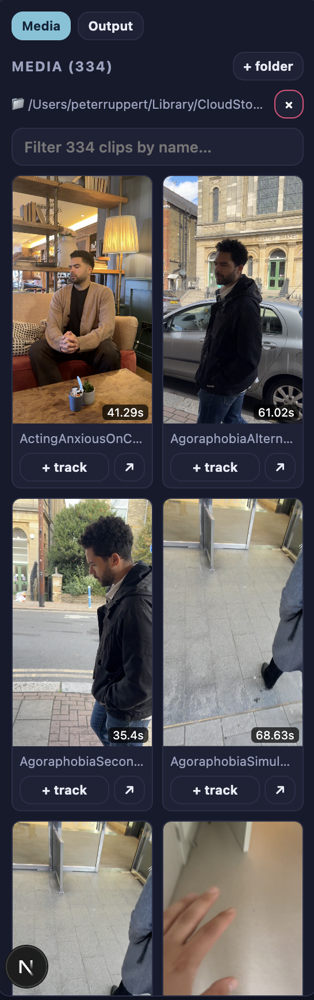
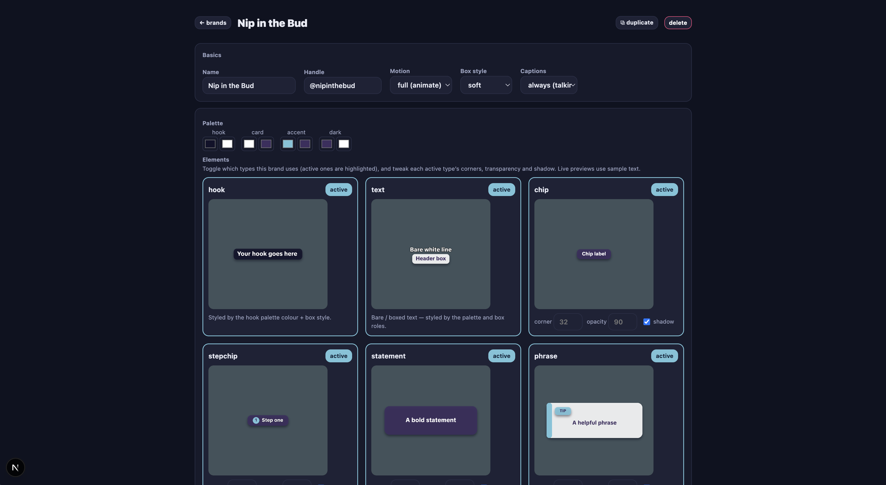
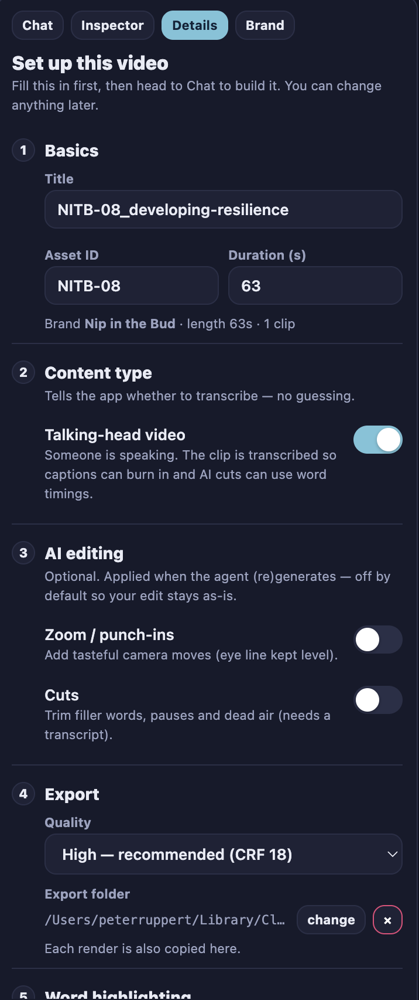

<h1 align="center">REEAILS</h1>

<b>On-brand short-form video, by prompt.</b>

REEAILS turns your own footage into polished, on-brand vertical (9:16) videos. Describe what you want and it builds it — captions, graphics, cuts, and camera moves, all styled to your brand — then you fine-tune anything by hand or keep chatting. Great short-form, without wrestling a traditional editor.

---

## ⬇ Download

### → [**Download for Mac**](https://github.com/pruppertjr/reeails-downloads/releases/latest/download/REEAILS-mac.dmg)

For Apple-Silicon Macs (M1 / M2 / M3). You'll need an access token — [request one](mailto:peter@anxietyfitness.com).

## Install

1. Open the downloaded file and drag **REEAILS** into your **Applications** folder.
2. Launch it — **the first time, right-click the app → Open** (then Open again to confirm).
3. Click the **🔑** in the top-right and paste your **access token** → Save.

Your footage never leaves your Mac, and your projects save automatically.

---

## A look inside

| Organise projects into folders | Your footage library |
|---|---|
|  |  |
| **Brand styling, live** | **Guided setup** |
|  |  |

---

## How it works

A video in REEAILS is built from a simple, editable plan — you shape it by chatting, by hand, or both.

### 1. Set it up (Details tab)
Give your video a **title** and **description** (your posting caption — you can write it or have the AI draft it), and flip the **Talking-head** switch on if there's someone speaking (so it can add captions). This is the first thing you see on a new project.

### 2. Add your footage (Media panel, left)
Click **+ folder** and point it at a folder of your clips. They appear as thumbnails — search, sort by newest, or switch to a list. **Drag a clip onto the timeline** to add it, or **★ star** clips to bring them into the chat's focus so you can talk about them.

### 3. Build it by chatting (Chat tab)
Describe the video — *"a 20-second clip with a punchy hook and a calm closing line."* REEAILS reads your footage and your brand, then builds an editable preview. It's **conversation-first**: it'll help you plan and pick clips, and only makes edits when you ask (or tap one of its **suggestion buttons**).

### 4. Fine-tune it (preview + timeline)
- **Preview (centre):** drag graphics to reposition, double-click to edit text, reframe your footage.
- **Timeline:** trim and cut clips (**C** for scissors, **V** for cursor), add **zoom / punch-ins** (keyframed, eye-line kept level), and delete anything with **Backspace**. Arrow keys nudge frame-by-frame.
- **Text tab:** edit every line's wording in one list — fast.
- **Inspector:** fine control over any selected element.

### 5. Make it on-brand (Brands)
Each brand carries its colours, fonts, element styles, and rules (safe zones, do's and don'ts) — so everything you make stays consistent. You can tweak how each element looks with live previews.

### 6. Export
Hit **Render** for a ready-to-post vertical MP4. Every render is saved as a version, and you can set an export folder to drop finished files wherever you like.

---

## Handy shortcuts

| Key | Action |
|---|---|
| **V** / **C** | Cursor tool / Scissors (cut) |
| **Backspace** | Delete the selected clip, caption, zoom, or graphic |
| **← / →** | Nudge one frame (Shift = 10 frames) |
| **Space** | Play / pause |
| **⌘Z** | Undo |

## Good to know

- Made for **Apple-Silicon Macs**. Auto-captions are still being added — for now, leave **Talking-head** off if a clip has no speech.
- Your projects and settings live on your Mac, so updating (installing a newer version over the old) never loses your work.

---

Questions or need access? <a href="mailto:peter@anxietyfitness.com">peter@anxietyfitness.com</a> 
☕ Enjoying REEAILS? <a href="https://www.paypal.com/paypalme/pfrjlimited">Leave a tip</a> — it helps keep it growing.

